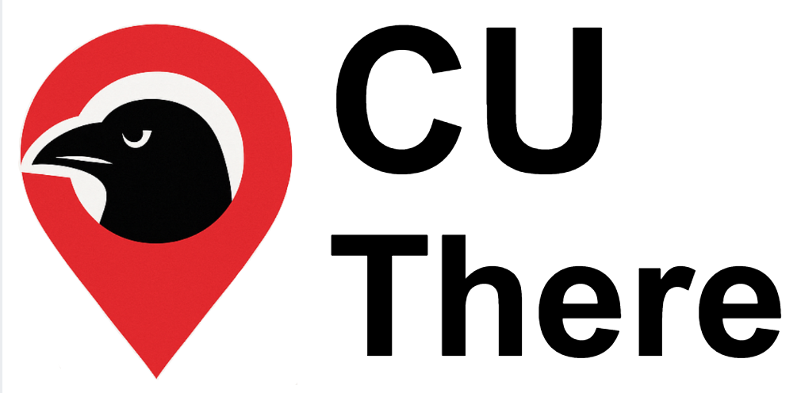

<p align="center">
  
</p>

# cuThere

**🔗 Live at [cuThere.app](https://cuthere.app)**

Find out what's happening at **Carleton University** — without scrolling through 140 club Instagram accounts.

cuThere scrapes campus club posts, uses AI to pick out the real events and pull their details, and shows them in one clean, searchable web app.

## How it works

Every day, an automated job:

1. Pulls the latest Instagram post from ~140 Carleton clubs (via Apify)
2. Asks Google Gemini *"is this an event?"* — and if so, extracts the title, date, time, location, host, and tags
3. Saves the event to the database and stores the flyer image

The web app then lets students **browse by week or category, search, RSVP, and add events to their calendar**.

## Tech

Next.js 15 · React 19 · Tailwind CSS · Turso (libSQL) · Google Gemini · Apify · installable PWA

## Run it locally

```bash
npm install
```

Create a `.env` file from the template and fill in your values — it's the single env file for the app, the scraper, and the scripts:

```bash
cp .env.example .env
```

Then:

```bash
node scripts/cleanDB.js             # build + seed the database (first run only — wipes existing data)
npm run dev                         # start the app at http://localhost:3000
node src/lib/pipeline/main.js       # run the scraper to pull in events
```

The scraper also runs on its own every day via GitHub Actions.

## Built by

Aaryan Biradar & Anushka Tankala

## License

MIT © 2026 Aaryan Biradar
